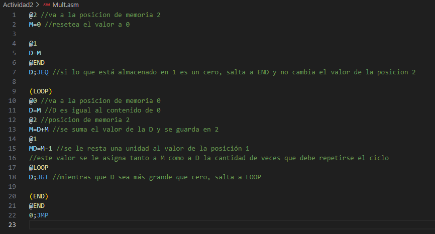
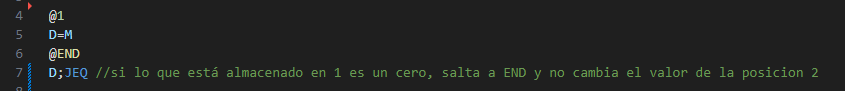
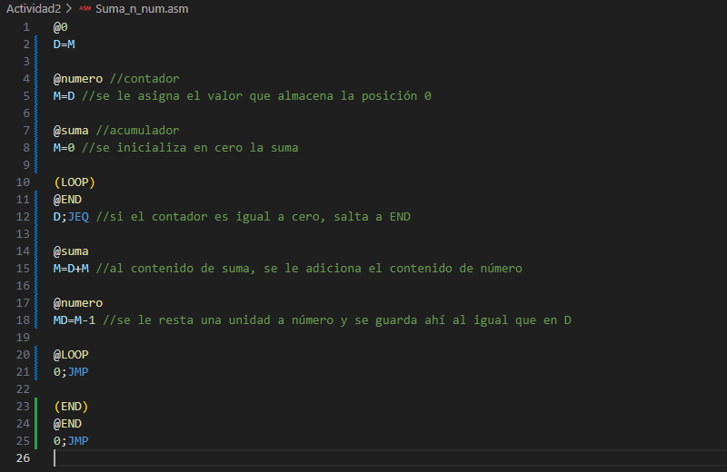
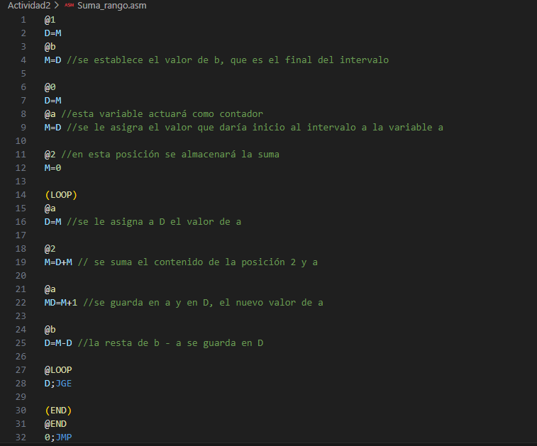

# El computador Hack (Nand2Tetris)

## Multiplicador de números enteros

### Explicación
En este programa se realizan los siguientes procesos:
- Se inicializa el valor de la posición 2 de la RAM en cero para evitar conflictos.
- Se evalúa si el número almacenado en la posición 1 es cero. En caso de ser cierto, salta a la posición de la etiqueta END en la ROM. Por otro lado, si es falso, entra al ciclo. Esto es necesario para evitar errores en las multiplicaciones por cero.
- En el ciclo, se pasa el valor de la posición 0 a D, luego se suma con el contenido de la posición 2 y se almacena aquí mismo. Las veces que se debe repetir es lo que indica el contenido de la posición 1, así que cada que se ejecuta un ciclo se le resta una unidad, para que así, cuando sea cero, salte al final y se conserve el resultado preciso.

### Proceso de creación
Este programa fue realizado directamente en lenguaje ensamblador tomando como base los ejercicios vistos en clase sobre saltos y ciclos.

La primera versión fue realizada en clase y aunque después de un par de pruebas manuales parecía funcionar correctamente, el archivo de prueba y comparación reveló que no era así. Esta versión no incluía lo siguiente

 

Que es el fragmento que considera que el número de repeticiones del ciclo podría ser cero y cómo actuar en esa situación para evitar un resultado incorrecto que era lo que sucedía en un principio.

## Sumador de números naturales hasta N

### Explicación
Aquí se realizan los siguientes procesos:
- A la variable numero (que actúa como contador) se le asigna el valor de la posición 0, que es donde se coloca hasta qué natural debería llegar la suma.
- Para evitar problemas, se inicializa la variable suma en cero.
- Dentro del ciclo, se evalúa si el contador es cero. En caso de ser cierto, salta a END. Si es falso, procede con la suma.
- Igualmente dentro del ciclo, en la variable suma se guarda el valor que tiene más el valor del contador, el cual al final de cada ciclo, merma en una unidad. Así, cuando numero llegue a cero, habrá terminado de operar los naturales solicitados.

### Proceso de creación
Este programa se intentó realizar directamente en lenguaje ensamblador, sin embargo, el proceso estaba siendo lento y el código tenía redundancias, incoherencias y conflictos. Es así, que por recomendación del profesor, se realizó el programa en pseudocódigo, primero pensando en un lenguaje de alto nivel y luego tratando de escribirlo de una forma similar a los ejemplos de los ejercicios del proyecto 4 de Nand2Tetris.

El resultado fue sorprendente, en cuestión de un par de minutos se logró programar en lenguaje ensamblador luego del proceso con el pseudocódigo. La diferencia fue realmente significativa, puesto que al usar variables, todo se pudo desarrollar de mejor manera.

## Sumador de números naturales en un rango incluyendo los extremos

### Explicación
Para este programa se va a asumir que a < b y que ambos números son enteros positivos, ya que de lo contrario, realizar las pruebas para comprobarlo, alargaría y enredaría el código. Aclarado lo anterior, aquí se realizan los siguientes procesos:
- Se le asigna a la variable b el valor final del intervalo, que también es el máximo valor al que podrá llegar la variable a.
- Se inicializa a en el valor inicial del intervalo.
- Se inicializa el valor de la posición 2 de la memoria RAM en 0, como método preventivo de cruce de valores en diferentes ejecuciones.
- En cada ciclo, el valor almacenado en a se le pasa a la variable D, para luego sumar esto con el contenido de la posición 2. Finalmente, se le suma una unidad al valor de a y se compara con el valor de b mediante una resta para saber si ya se ha llegado al extremo del intervalo. Si ya se sumó el extremo final, el ciclo termina.

### Proceso de creación
Dada la experiencia del anterior ejercicio, este programa se comenzó a planear desde el pseudocódigo. En esta ocasión, no se hizo la pequeña adaptación del segundo ejercicio a un lenguaje más cercano al ensamblador, sino que se conservó unicamente la de pseudocódigo pensado desde un lenguaje de alto nivel.

Se notó cierto cambio, sin esta adaptación el proceso fue un poco más demorado. Sin embargo, fue más sencillo que hacerlo directamente en lenguaje ensamblador.

## Conclusión

De las tres diferentes experiencias con cada programa, se puede concluir que el camino más adecuado sería el del segundo ejercicio, pasando por tres pasos para obtener el programa en lenguaje ensamblador. Podría pensarse que es esfuerzo desperdiciado, pero definitivamente hace más llevadero el proceso, ya que evita la frustración.
